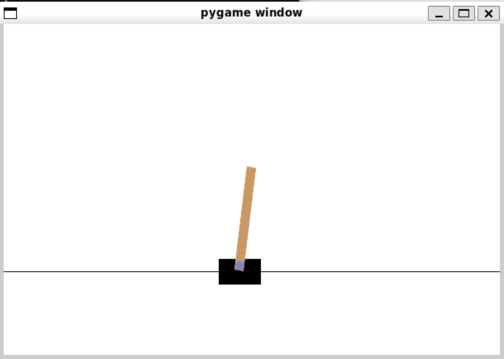

# PPO Implementation for Cart-pole Balancing

I implemented PPO to solidify and apply my RL concepts.



## Installation
Prerequisites:
* Python 3.9
* [Poetry](https://python-poetry.org)

Dependencies:
```
poetry install
```

Train script:
```
bash run.sh
```

* You can modify the train command in [run.sh](./run.sh) with arguments from [args.py](./args.py)
* Videos are captured to assess performance

<span style="color:lightgray">Code referenced from [here](https://github.com/vwxyzjn/ppo-implementation-details)</span>

## Generalized Advantage Estimation (GAE)

```latex
\begin{algorithm}
\caption{Generalized Advantage Estimation (GAE)}
\begin{algorithmic}[1]
\State \textbf{Input:} Rewards $r$, Values $V$, Next value $V(s_{t+1})$, Discount factor $\gamma$, GAE parameter $\lambda$
\State \textbf{Output:} Advantages $A$

\State Initialize $A \leftarrow \text{zeros\_like}(r)$
\State Initialize $\text{lastGAE} \leftarrow 0$

\For{$t \leftarrow T-1$ \text{to} $0$ \text{step} $-1$}
    \If{$t = T-1$}
        \State $\text{nextNonTerminal} \leftarrow 1.0 - \text{done}$
        \State $\text{nextValue} \leftarrow V(s_{t+1})$
    \Else
        \State $\text{nextNonTerminal} \leftarrow 1.0 - d_{t+1}$
        \State $\text{nextValue} \leftarrow V_{t+1}$
    \EndIf
    \State $\delta_t \leftarrow r_t + \gamma V(s_{t+1}) \cdot (1 - d_{t+1}) - V(s_t)$
    \State $A_t \leftarrow \delta_t + \gamma \lambda (1 - d_{t+1}) A_{t+1}$
    \State $\text{lastGAE} \leftarrow A_t$
\EndFor
\State \textbf{return} $A + V$
\end{algorithmic}
\end{algorithm}
