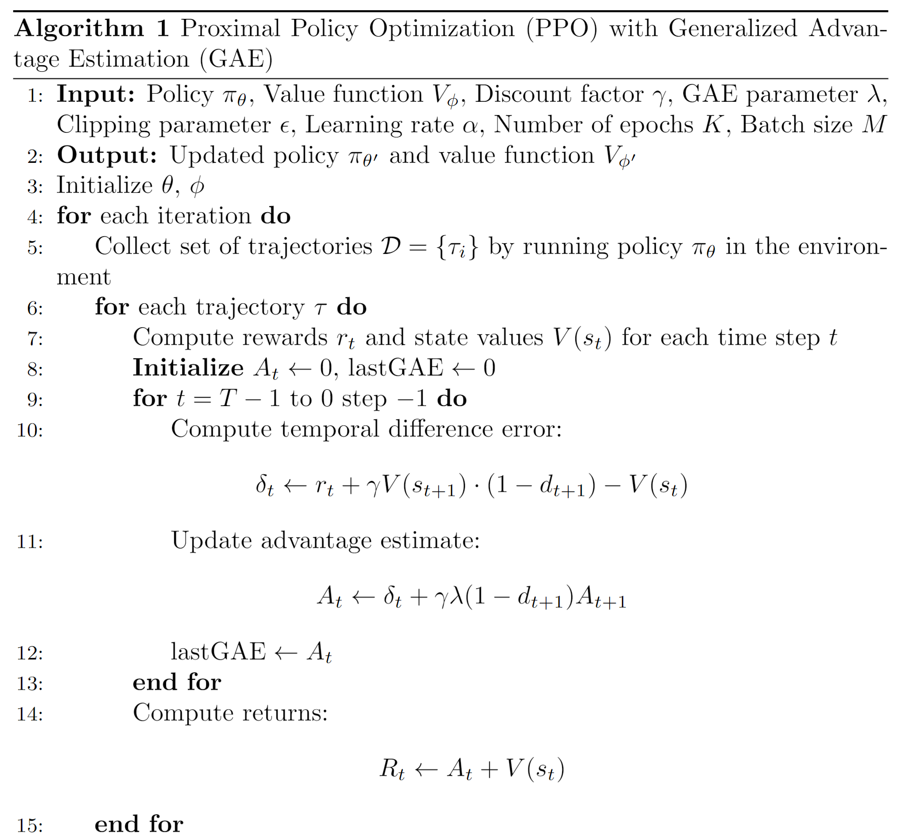
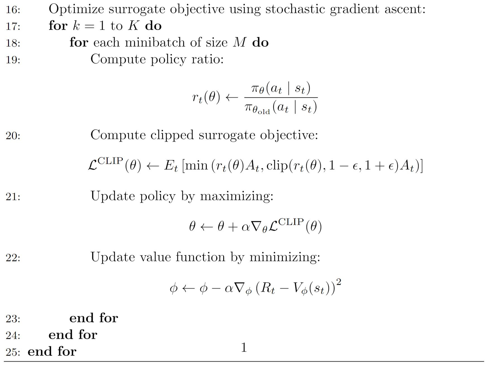

# PPO Implementation for Cart-pole Balancing

I implemented PPO to solidify and apply my RL concepts.

<p float="left">
  
  
</p>


## Installation
Prerequisites:
* Python 3.9
* [Poetry](https://python-poetry.org)

Dependencies:
```
poetry install
```

Train script:
```
bash run.sh
```

* You can modify the train command in [run.sh](./run.sh) with arguments from [args.py](./args.py)
* Videos are captured to assess performance

<span style="color:lightgray">Code referenced from [here](https://github.com/vwxyzjn/ppo-implementation-details)</span>

